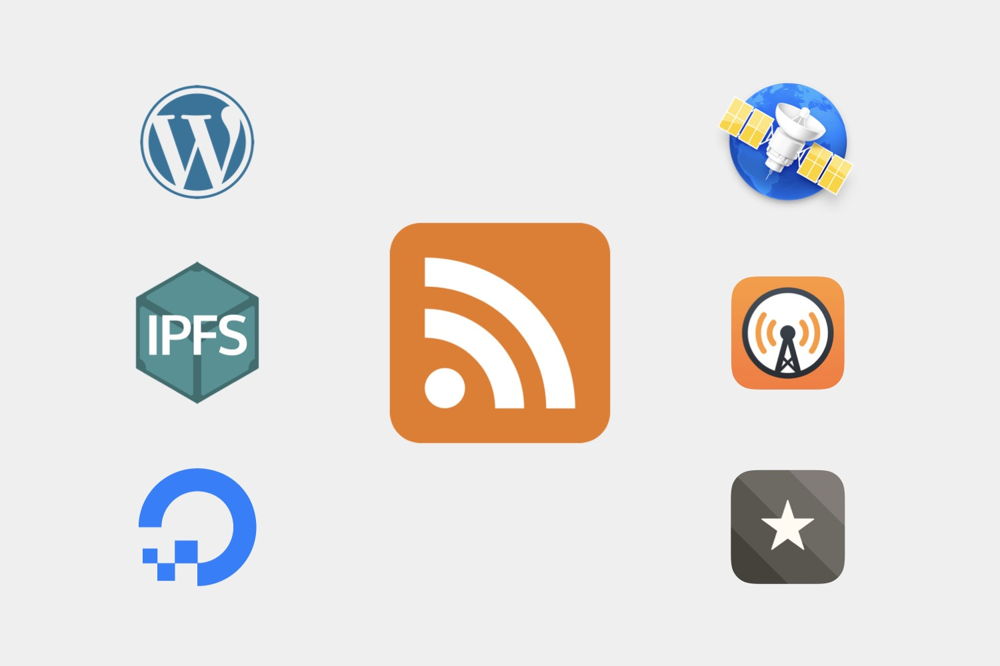

***This post originally appeared on [Medium](https://medium.com/offline-camp/we-should-learn-from-rss-31d100c81d26)***

Let's talk about RSS. You may have heard of it or seen it appear across the web. Perhaps you have always wondered what it is, or perhaps you already know all about it. No matter which it is, I want to talk about why you should care about RSS and why we should learn from it.

<iframe width="560" height="315" src="https://www.youtube-nocookie.com/embed/RVG7zZpvYJY" title="YouTube video player" frameborder="0" allow="accelerometer; autoplay; clipboard-write; encrypted-media; gyroscope; picture-in-picture" allowfullscreen></iframe>

## What is RSS?

RSS is a web feed format that is used to distribute content across the web.[^1] Two types of content that are commonly distributed over RSS include blog feeds and podcasts.

If you have ever listened to a podcast, that episode you listened to was most likely distributed using RSS. You may even be reading this post using RSS.

## RSS Gives Control

When content is consumed from the web, there are two players that matter: **content producers and consumers**. RSS empowers both and gives producers control over how they produce and distribute their content, while also giving consumers control over how they consume content.

With RSS, content producers can **own their content** while still successfully reaching consumers. Unlike other media industries, there is no need to give up ownership in order to increase distribution. A content producer can host their content wherever and however they like. This could be on their own servers under their own domain. Or maybe they own the domain but use a hosting service to host their content. Perhaps they use a large content management system or a statically generated site. No matter what they choose, they can simply publish an RSS feed to distribute their content to the open web.

RSS allows consumers to consume content however they prefer, without having to give up the convenience of discovering content. In other words, it allows consumers to bring their own [user agent](https://en.wikipedia.org/wiki/User_agent). The "user agent" in this case is an RSS reader or podcast player. Any user agent can be used to access the content from any content creator. Do you not like the changes your podcast player made in the latest update? Switch to another one while still being able to listen to the same podcasts. Did the RSS reader you were using for years announce they were stopping future development? Move your feeds to a different reader and pickup right where you left off.

The consumer can use whatever user agent they prefer and the content producer can produce their content however they like, without either caring what the other is doing. Both players have **total control over how they use the web**, while still being able to discover and connect to one another.

## Not having control

RSS is the example I use when describing how the web should work. Just as useful is having a counter-example for how the web **should not work**.

My counter-example is _Medium_. This is ironic (or maybe hypocritical?) since I am producing this post using Medium and there is a high chance you are consuming this post using Medium.[^2] Nevertheless, I hope you can see why Medium takes away control from both of us.

For content producers, Medium is both a writing tool and publishing platform. Producers must use the Medium editor in order to publish their content. Sure, we can write drafts using any tool we like, but eventually every post must be published using their editor. This means producers do not have full control over how their content is created and shown. My current frustration is the lack of support for footnote linking in Medium.[^3] If you have ever used the Medium editor, you may think it works just fine for you; until it doesn't. I also do not own my content that is published to Medium. What happens if Medium goes away? What happens if they break links to my post?

As consumers, Medium takes away control over how you consume and discover content. There is a lot of great content on Medium. But, how can you discover and consume this content? You most likely are using the Medium website or mobile app. Today, Medium has support for subscribing to a blog using an RSS feed. But, what happens when they remove this functionality?[^4] What happens when they add a [paywall](https://help.medium.com/hc/en-us/articles/360018834314-Stories-that-are-part-of-the-metered-paywall)? How do you discover content that is not on Medium? What about the content producers that do not want to publish on Medium?

The more content producers that use Medium, the more it pushes out consumers who do not. The more consumers that use Medium, the more it pushes out content producers that do not. This is not an open web. This is a closed web.

## Learning from RSS

RSS is not perfect or even close to being perfect. And neither is the open web. But, I hope you can see how we can learn from RSS to build and use the web we want. For me, RSS is the best example to describe to others how I believe the web should work. No matter what your role is in the web, think about what _you_ want the web to be. And maybe think about using RSS as your example, too.

As a consumer, think about **supporting independent content creators**. Does the platform you use to consume their content support them? If not, why not? Think about the reasons and tradeoffs being made when you use that platform.

As a content creator, think about the **ownership of your content**. Do you really own the content you are producing? Does the platform you use empower and give you control over your content? If not, think about why you use that platform? What benefits does it provide?

As a developer, think about why RSS has been successful. Why have podcasts been so successful while blog feeds are struggling to keep up with other platforms like Medium? How can this pattern be improved and applied to other areas of the web?

## Using RSS

If you are just learning about RSS and want to start supporting it more, I encourage you to checkout different RSS readers and podcast players. Some RSS readers I use are [NetNewsWire](https://nnw.ranchero.com) and [Reeder](https://reederapp.com). My main podcast player is [Overcast](https://overcast.fm). A quick web search will bring up many different options.

[^1]: Atom is another web feed format. Personally, I use the term RSS even when what I am talking about applies to both. Just note they are different formats that try to accomplish the same thing.

[^2]: This post also exists on my [personal blog](https://codyhatfield.me). However, this Medium post is the canonical link. Medium has support for [canonical links](https://help.medium.com/hc/en-us/articles/360033930293-Set-a-canonical-link) to make sure this pattern does not harm content discovery and search engines. To be fair, Medium has many tools today that play fair with the open web. But, what is the net effect?

[^3]: Isn't it annoying to have to scroll back and forth between footnotes? Thanks for coming down here anyway!

[^4]: Did you know [Twitter](https://mashable.com/2012/09/05/twitter-api-rss/) and [Facebook](https://www.wprssaggregator.com/facebook-to-remove-rss-feeds-as-from-june-23-2015/) used to support RSS? Hmm.
